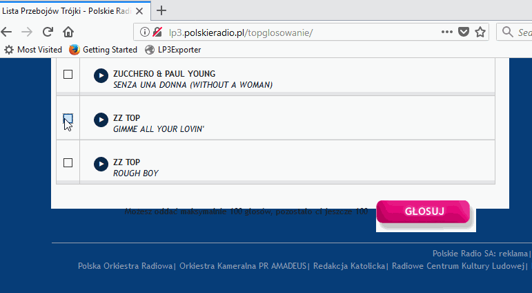

# Description

A small tool, useful for exporting votes for "Lista Przebojów Trójki" to external programs.

# How to install

Add the LP3Exporter bookmarklet to your browser.

1. Make sure the bookmarks/favorites bar is visible in your browser.
1. Drag this link: <a href="javascript:(function()%7Bvar%20rows%20%3D%20document.getElementsByTagName('tr')%3Bvar%20votedSongs%20%3D%20%5B%5D%3Bfor%20(var%20i%20%3D%200%3B%20i%20%3C%20rows.length%3B%20i%2B%2B)%20%7Bvar%20checkbox%20%3D%20rows%5Bi%5D.getElementsByClassName('chk')%3Bif%20(checkbox.length%20%3E%200%20%26%26%20checkbox%5B0%5D.checked)%7BvotedSongs.push(rows%5Bi%5D)%3B%7D%7Dvar%20result%20%3D%20''%3Bfor%20(var%20i%20%3D%200%3B%20i%20%3C%20votedSongs.length%3B%20i%2B%2B)%7Bvar%20artist%20%3D%20votedSongs%5Bi%5D.getElementsByClassName('bArtist')%5B0%5D.textContent%3Bvar%20title%20%3D%20votedSongs%5Bi%5D.getElementsByClassName('bTitle')%5B0%5D.textContent%3Bresult%20%2B%3D%20(i%20%2B%201)%20%2B%20'%5Ct'%20%2B%20artist%20%2B%20'%20'%20%2B%20title%20%2B%20'%5Ct'%20%2B%20'%5Cn'%3B%7Dvar%20textarea%20%3D%20document.createElement(%22textarea%22)%3Btextarea.id%20%3D%20%22lp3ExportFeature%22%3Btextarea.cols%20%3D%20%22100%22%3Btextarea.rows%20%3D%20%2210%22%3Btextarea.textContent%20%3D%20result%3Btarget%20%3D%20document.getElementById('divCenter')%3Btarget.appendChild(textarea)%3Balert('Your%20votes%20are%20displayed%20at%20the%20bottom%20of%20the%20page.')%7D)()">LP3Exporter</a> to the bar

To learn more about bookmarklets you can refer to the excellent [installation guide on the Pocket website](https://help.getpocket.com/article/987-using-the-pocket-bookmarklet).

# Usage

1. Select the songs on LP3
2. Run the bookmarklet
3. Results are visible at the bottom of the screen

